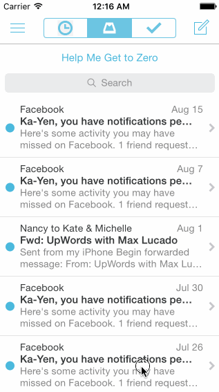

## Mailbox

The purpose of this homework is to leverage animations and gestures to implement more sophisticated interactions. We're going to use the techniques from this week to implement the Mailbox interactions.

Time spent: `10 hours`

### Features

#### Required

- [x] On dragging the message left:
  - [x] Initially, the revealed background color should be gray.
  - [x] As the reschedule icon is revealed, it should start semi-transparent and become fully opaque. If released at this point, the message should return to its initial position.
  - [x] After 60 pts, the later icon should start moving with the translation and the background should change to yellow.
    - [x] Upon release, the message should continue to reveal the yellow background. When the animation it complete, it should show the reschedule options.
  - [x] After 260 pts, the icon should change to the list icon and the background color should change to brown.
    - [x] Upon release, the message should continue to reveal the brown background. When the animation it complete, it should show the list options.

- [x] User can tap to dismiss the reschedule or list options. After the reschedule or list options are dismissed, you should see the message finish the hide animation.
- [x] On dragging the message right:
  - [x] Initially, the revealed background color should be gray.
  - [x] As the archive icon is revealed, it should start semi-transparent and become fully opaque. If released at this point, the message should return to its initial position.
  - [x] After 60 pts, the archive icon should start moving with the translation and the background should change to green.
    - [x] Upon release, the message should continue to reveal the green background. When the animation it complete, it should hide the message.
  - [x] After 260 pts, the icon should change to the delete icon and the background color should change to red.
    - [x] Upon release, the message should continue to reveal the red background. When the animation it complete, it should hide the message.

#### Optional

- [ ] Panning from the edge should reveal the menu.
  - [ ] If the menu is being revealed when the user lifts their finger, it should continue revealing.
  - [ ] If the menu is being hidden when the user lifts their finger, it should continue hiding.
- [ ] Tapping on compose should animate to reveal the compose view.
- [ ] Tapping the segmented control in the title should swipe views in from the left or right.
- [ ] Shake to undo.

#### The following **additional** features are implemented:

- [x] Message reanimates back to inbox after 1.5 seconds after being cleared (to simulate undoing); makes it easier to record/demo all available message actions.

Please list two areas of the assignment you'd like to **discuss further with your peers** during the next class (examples include better ways to implement something, how to extend your app in certain ways, etc):

1. Better way to visualize and tweak animations than compile-run-repeat?
2. Best practices when dealing with linked Storyboard outlets/actions and programmatic ones (how do you keep track?)

### Video Walkthrough

Here's a walkthrough of implemented user stories:

GIF created with [LiceCap](http://www.cockos.com/licecap/).

## Notes

* Found myself having to refactor a lot of code due to the trial and error nature of the project; at first I used velocity to determine the different action triggers but then realized the only parameter that mattered was the positioning — ended up spending a lot of time reorganizing conditionals and felt more like I was coding than prototyping for the most part, which is not necessarily a bad thing.

* Realized the `convertValue` function in `Common.swift` is basically the `Utils.modulate` function in Framer, which came in handy when animating the opacity of the archive and later icons based on the positioning threshold of the message pan.

## License

    Copyright 2016 Jonathan E. Chen

    Licensed under the Apache License, Version 2.0 (the "License");
    you may not use this file except in compliance with the License.
    You may obtain a copy of the License at

        http://www.apache.org/licenses/LICENSE-2.0

    Unless required by applicable law or agreed to in writing, software
    distributed under the License is distributed on an "AS IS" BASIS,
    WITHOUT WARRANTIES OR CONDITIONS OF ANY KIND, either express or implied.
    See the License for the specific language governing permissions and
    limitations under the License.
